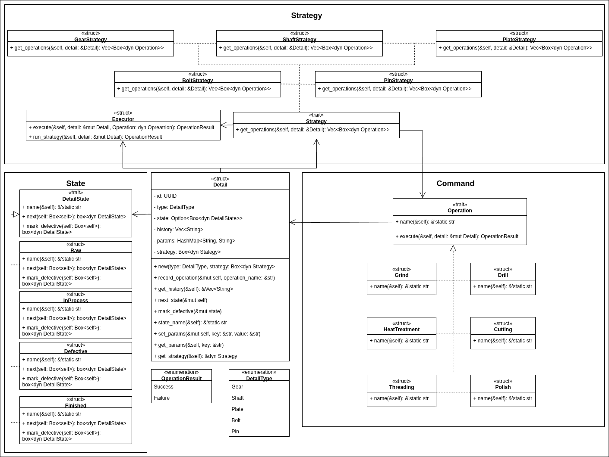

# Производственный процесс деталей

В этом репозитории реализована объектная модель процесса **производства деталей**.  

Особенности реализации:  
- Для каждой детали выполняется **последовательность операций** (например, шлифование, сверление, термообработка).  
- **Результат одной операции может использоваться** в другой операции.  
- Для разных типов деталей **последовательность операций может отличаться**.  
- Реализация включает **объектную модель (UML-диаграмма)**, код на Rust, юнит-тесты и применение паттернов проектирования.

---

## Объектная модель (UML)

